# NekoDash 🐾

> **A kawaii mobile puzzle game where every swipe is a purr-fectly planned slide.**

NekoDash is a single-player, mobile-first, kawaii-themed 2.5D top-down puzzle game built with **Godot 4.3**. Navigate a cute cat through grid-based environments using "sliding movement": once you swipe, you slide until you hit a wall!

Your goal? **Cover every single tile on the floor.** It's like [Pokémon's ice cave puzzles](https://bulbapedia.bulbagarden.net/wiki/Ice_Path), but with the added challenge of 100% coverage and a mathematically optimal move counter to beat.

https://github.com/user-attachments/assets/50b15f1e-930d-415b-91b7-043c8550722c

## 🎮 Gameplay Mechanics

- **Sliding Movement**: Swipe to slide. You can't stop mid-grid. Plan your path using obstacles!
- **100% Coverage**: The level only ends when every walkable tile has been visited.
- **Star Rating System**: Compare your moves against the BFS-computed minimum.
- **Special Tiles**:
  - 💀 **Kill Tiles**: Reset the level on contact.
  - 🛑 **Stop Tiles**: Interrupt your slide mid-grid.
  - ➡️ **One-Way Tiles**: Restrict entry from specific directions.

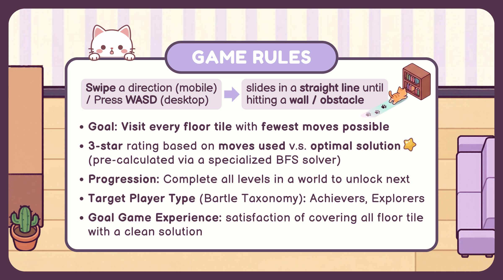

## 🖼️ Screenshots

| Screen              |                          Desktop                          |                              Mobile                              |
| :------------------ | :-------------------------------------------------------: | :--------------------------------------------------------------: |
| **Main Menu**       |   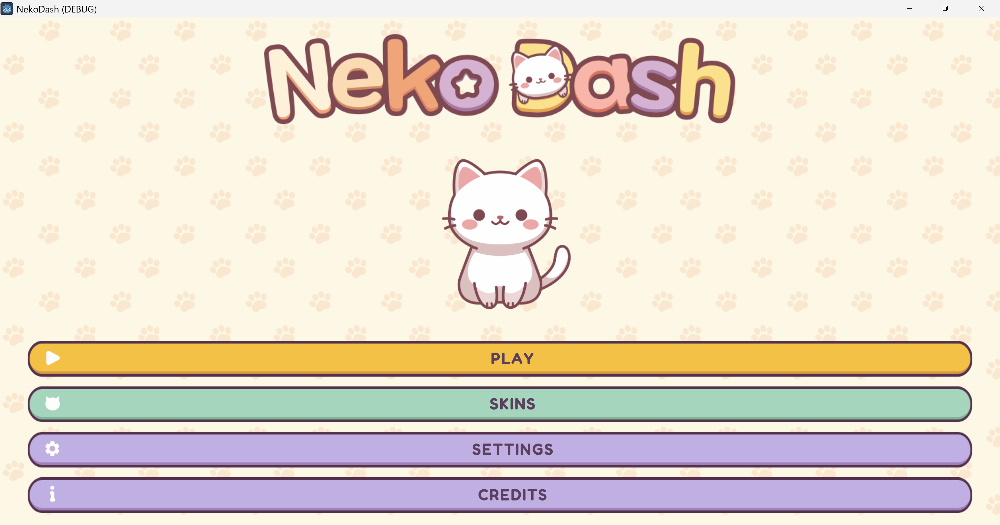    |   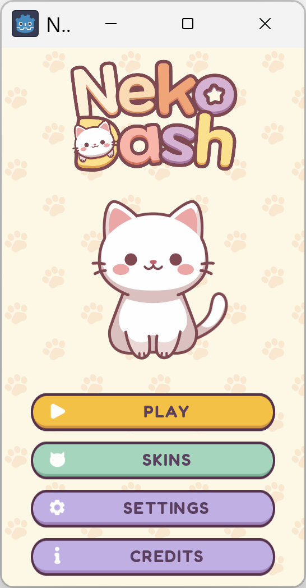    |
| **Level Selection** |  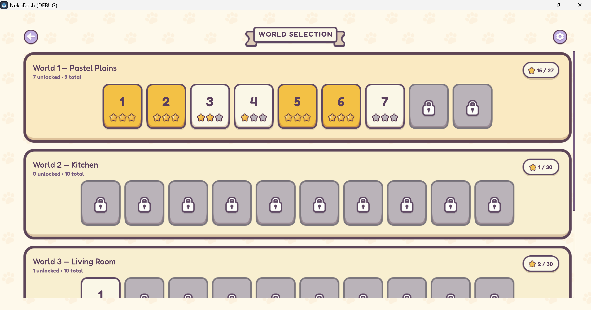  |  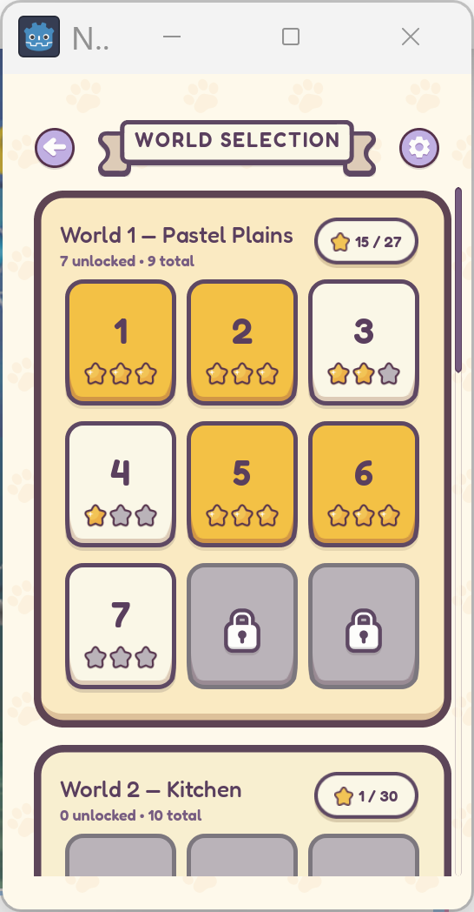  |
| **Gameplay**        |    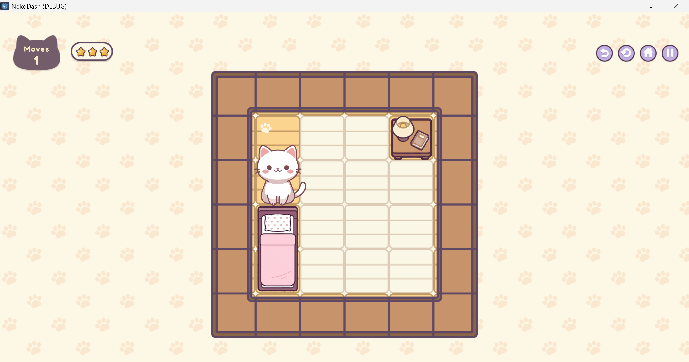    |    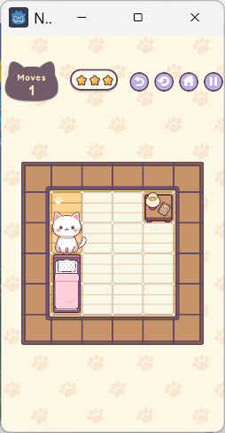    |
| **Level Complete**  | 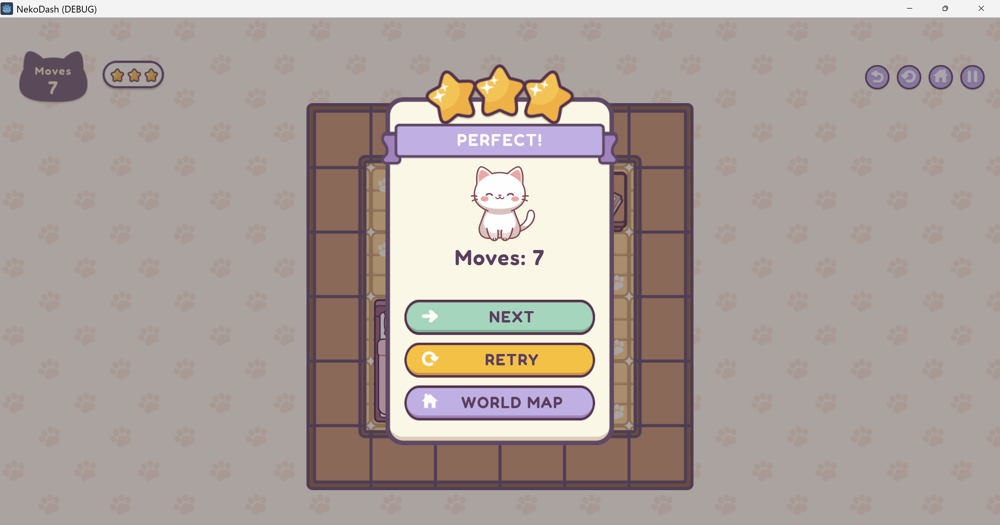 | 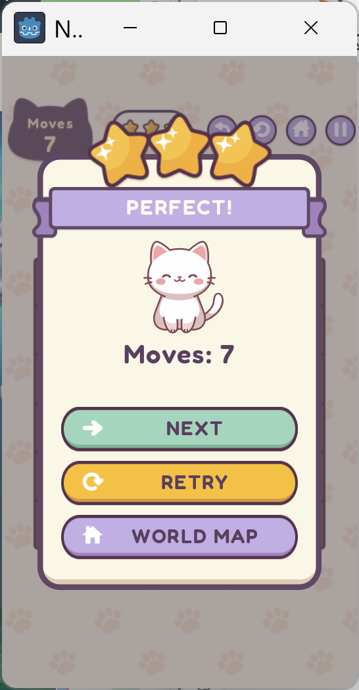 |
| **Skin Selection**  |     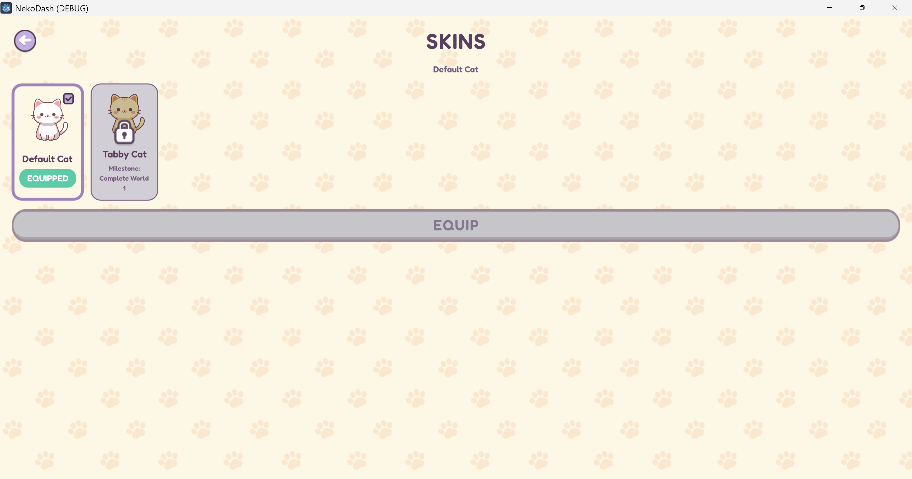      |     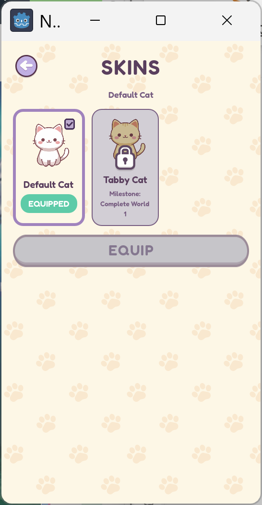      |

## 🧩 Example Levels

The game features a gradual difficulty curve, starting with simple tutorials and progressing to complex grids with special tiles.

|         Tutorial Levels (Introduction)          |           Special Tiles (Advanced)            |
| :---------------------------------------------: | :-------------------------------------------: |
| 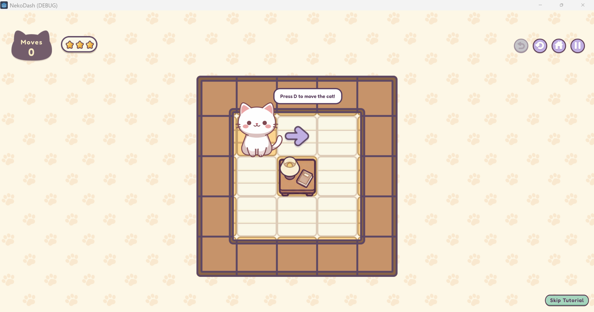 | 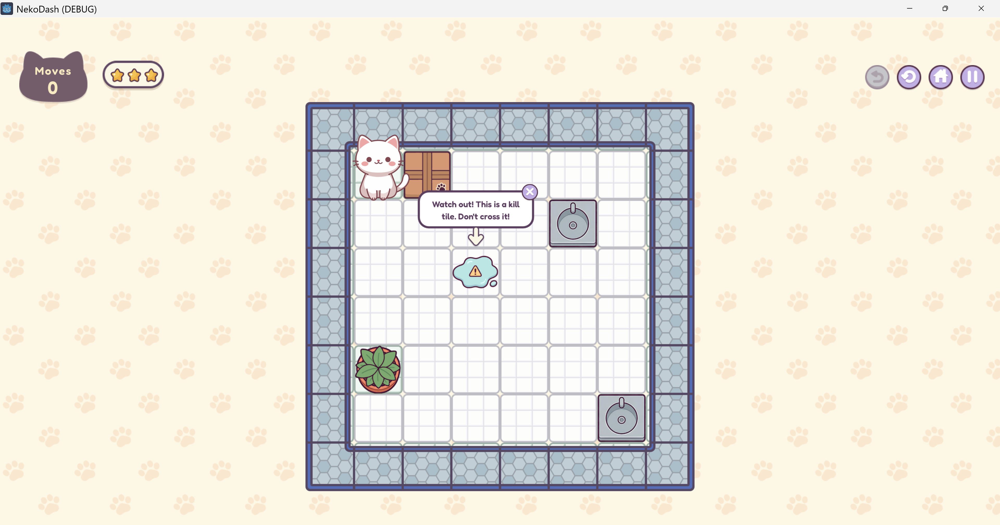 |
| 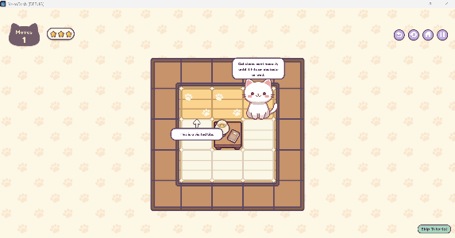 | 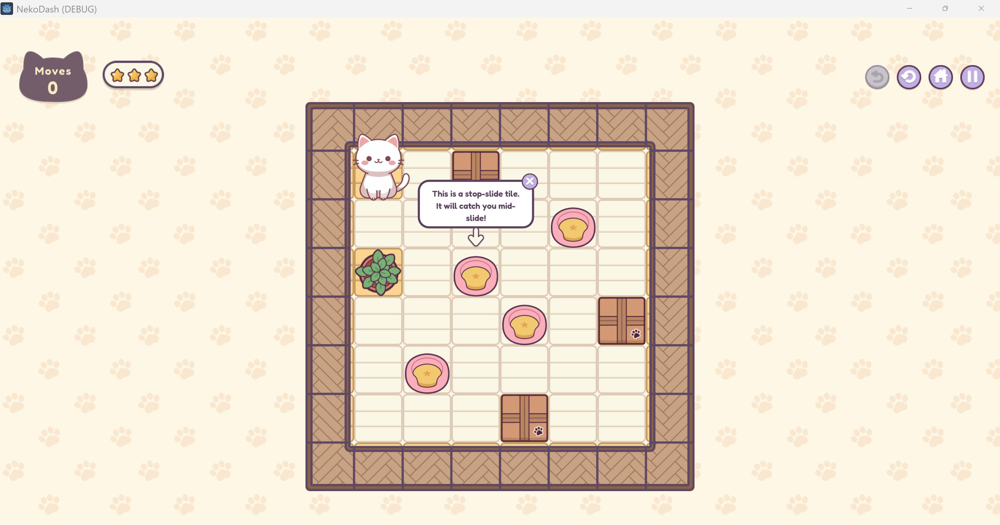 |
| 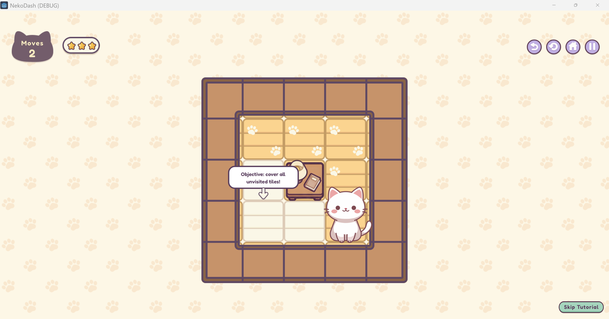 | 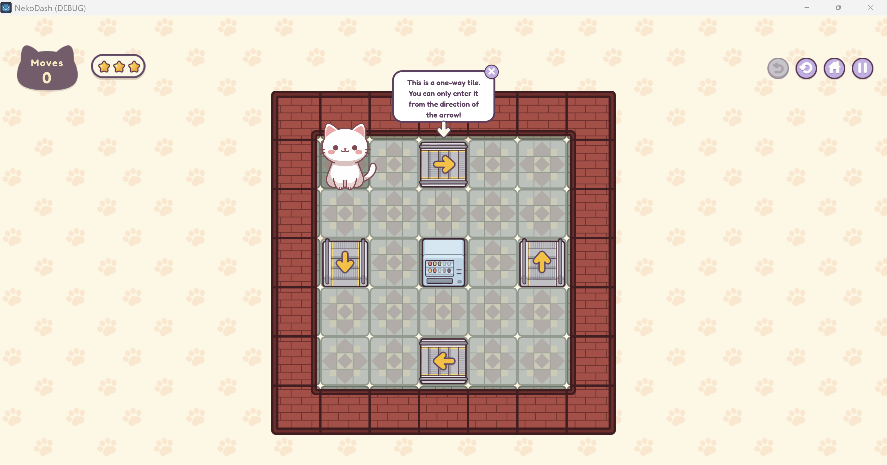 |

## 🌍 Four Themed Worlds

NekoDash features 36 levels across four distinct environments:

- **Bedroom**: Soft, cozy wooden floors.
- **Kitchen**: Minty clean tiles with appliances.
- **Living Room**: Golden-hour light oak.
- **HKU Special**: Outdoor campus theme inspired by the HKU Main Building.

## 🛠️ Technical Stack

- **Engine**: Godot 4.3 (GDScript)
- **Art**: Figma
- **Level Design**: LLM-Assisted + Headless BFS Solver (GDScript/Python)
- **UI**: Responsive Control nodes with Custom Theme
- **Audio**: Centralized `SFXLibrary` with per-world BGM tracks

## ✨ Key Features

### Original 2.5D Kawaii Art

Every asset in NekoDash is original work designed in Figma. The game features a consistent 2.5D orthographic-lite perspective with soft pastel colors, dark plum outlines, and rounded shapes.

  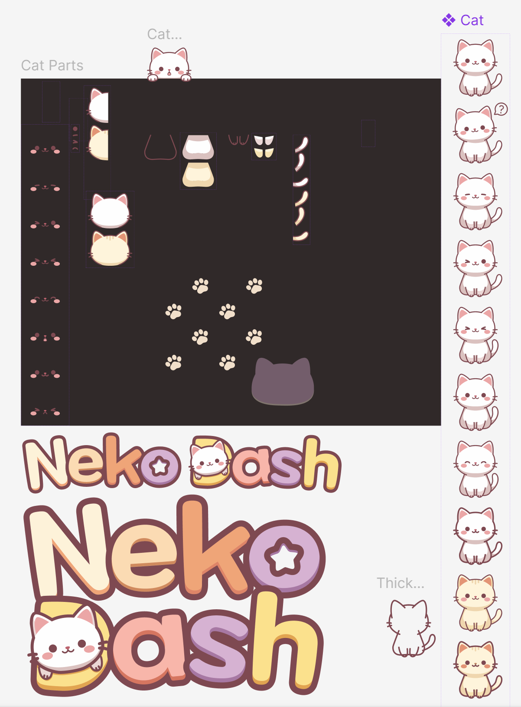
  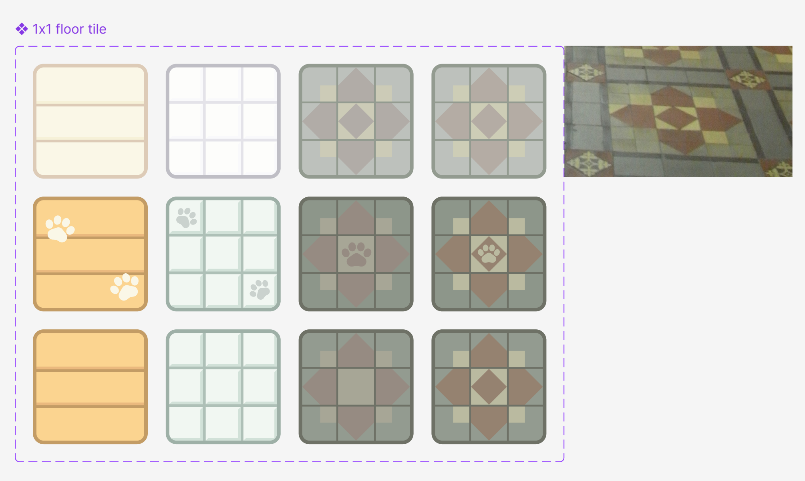
  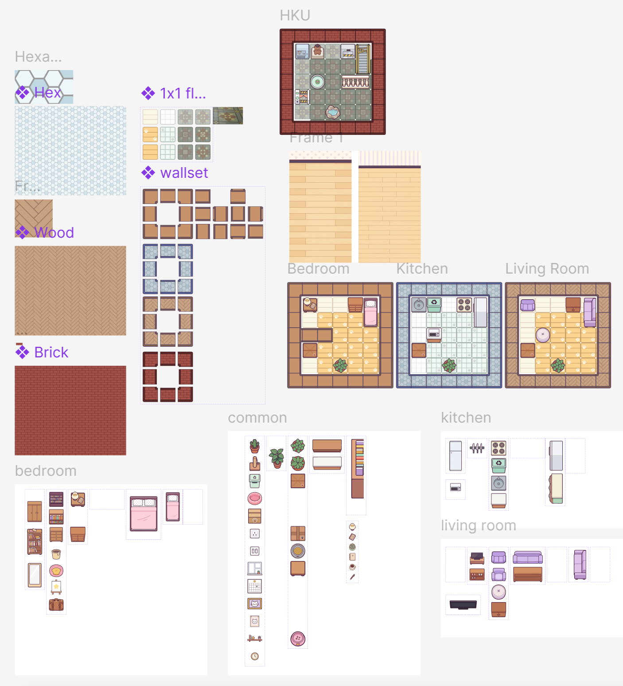

### BFS-Validated Level Generation

Designing 36 solvable and fun puzzles is tough! NekoDash uses a two-stage automated pipeline:

1. **LLM Proposers**: Generate candidate layouts under strict constraints.
2. **Headless BFS Solver**: Validates solvability and computes the optimal 3-star thresholds.
   Every level you play is mathematically guaranteed to be solvable and balanced.

### Full Cross-Platform Support

Play on **Android** with intuitive touch swipes or on **Desktop** with WASD/Arrow keys. The UI is fully responsive and scales across all screen sizes.

## 🚀 Installation

### Android

1. Download the `nekodash.apk` from the [latest release](https://github.com/gracetyy/nekodash/releases).
2. Transfer the `.apk` file to your device.
3. Enable "Install from Unknown Sources" in settings.
4. Install and play!

### Desktop (Windows)

1. Download the `NekoDash_Windows.zip` from the [latest release](https://github.com/gracetyy/nekodash/releases).
2. Extract the ZIP folder.
3. Ensure `nekodash.exe` and `nekodash.pck` are in the same folder.
4. Run `nekodash.exe`.

### Building from Source

1. Install **Godot 4.3** (Standard Build).
2. Clone this repo: `git clone https://github.com/gracetyy/nekodash.git`.
3. Import `project.godot` into Godot.
4. Press **F5** to run!

## 🐱 Easter Egg: Developer Mode

Want to unlock all levels and skins without any limitation?

1. Go to the **Option Menu**.
2. Rapidly tap the **Cat Head** above the purple ribbon 10 times.
3. View the developer options at the end of the menu!

## 📜 Credits

### Frameworks & Tools

- **Template**: Partially adapted from [Maaack's Game Template](https://github.com/Maaack/Godot-Game-Template)

### Fonts

- **[Fredoka](https://fonts.google.com/specimen/Fredoka)** - Google Fonts (OFL)
- **[Nunito](https://fonts.google.com/specimen/Nunito)** - Google Fonts (OFL)

### Music

- **[Bumper Audio Pack](https://ci.itch.io/bumper-audio-pack)** by Chequered Ink
- **[Music Loop Bundle](https://tallbeard.itch.io/music-loop-bundle)** by Abstraction
- **[Seth_Makes_Sounds](https://freesound.org/people/Seth_Makes_Sounds/sounds/709779/)** on freesound.org

### Sound Effects

- **[400 Sounds Pack](https://ci.itch.io/400-sounds-pack)** by Chequered Ink
- **[Shapeforms Audio Free SFX](https://shapeforms.itch.io/shapeforms-audio-free-sfx)**
- **[Universal UI/Menu Soundpack](https://cyrex-studios.itch.io/universal-ui-soundpack)** by Nathan Gibson
- **[Geoff-Bremner-Audio](https://freesound.org/people/Geoff-Bremner-Audio/sounds/653233/)** on freesound.org

### UI Assets

- **[Free Icon Pack](https://nieobie.itch.io/free-icons)** by Nieobie
- **[Game UI Wireframe Kit](https://www.figma.com/community/file/1387093843913812299/game-ui-wireframe-kit)** by GavMakesGames

---

_Developed with ❤︎⁠ as a solo project for COMP3329: Computer Game Design and Programming_
